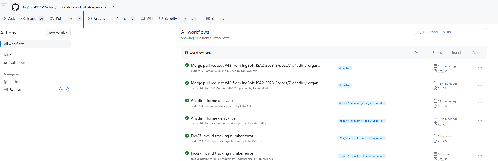

# Configuración del Pipeline

Se han agregado dos scripts "build-validator.yml" y "pr-test-validator.yml", los cuales son configuraciones de acciones (actions) en GitHub Actions, que son parte de un pipeline de integración continua (CI).

En este caso, uno se encarga de compilar el código de .NET (build-validator.yml) y el otro se encarga de ejecutar pruebas (pr-test-validator.yml). A continuación, explicaré la razón por la que los has agregado al pipeline y su vínculo con el tablero de trabajo ágil.

## ¿Cuándo?

Ambos, se ejecutan cuando se dispara una acción de "_push_" o un nuevo "_pull request_" en las branch main, develop o release.

## ¿En qué ramas?

Suceden en las ramas "_main_", "_develop_" y "_release_"

## ¿Dónde se encuentran los scripts?

Los scripts se pueden encontrar en el siguiente directorio:

```
├── .github
|   ├── workflows
|   |    ├── build-validator.yml
|   |    └── pr-test-validator.yml
```

## Pasos

### Pasos de build-validator.yml

- Checkout del repositorio.
- Configuración de .NET Core.
- Instalación de dependencias.
- Compilación del proyecto.

### Pasos de pr-test-validator.yml

- Checkout del repositorio.
- Configuración de .NET Core.
- Instalación de dependencias.
- Ejecución de pruebas unitarias.

## ¿Cómo se ven?

Se pueden ver de dos maneras:

1. Bajo la pestaña "Actions":



1. En la parte final de la conversación dentro de un PR:


